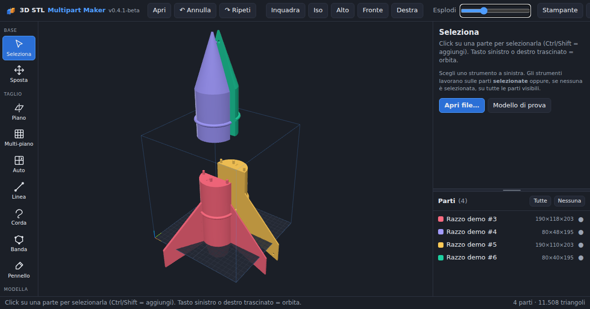

# 3D STL Multipart Maker
**Versione: 0.5.2-beta — 2026-09-28 11:47**



Divide modelli 3D troppo grandi per la stampante in **parti stampabili**, con perni, tenoni, magneti, chiavette o code di rondine, numerazione dei giunti e **guida di montaggio PDF**.
Tutto il calcolo avviene sul tuo computer: nessun modello viene caricato in rete. Gratis e open source.

## Usala subito
- **Web:** [chicco83.github.io/3d-stl-multipart-maker](https://chicco83.github.io/3d-stl-multipart-maker/) — Chrome o Edge consigliati.
- **Windows portable:** scarica l'exe dalla pagina [Releases](https://github.com/chicco83/3d-stl-multipart-maker/releases) e avvialo con doppio clic (nessuna installazione).
- **Manuale dentro l'app:** pulsante **?** in alto a destra oppure tasto **F1**.

## Funzioni in breve
- Import STL, 3MF, OBJ · export STL, 3MF, ZIP con **guida di montaggio PDF**
- **Procedura guidata** in 7 passi: modello → stampante → orientamento → metodo → giunti e taglio → controllo → esporta
- Tagli: piano, multi-piano, **automatico secondo il volume della stampante**, linea, corda, banda elastica, pennello
- Giunti: perni, tenoni sciolti, magneti, **chiavetta**, **coda di rondine**, innesto rastremato; tipo diverso per ogni taglio; numeri incisi
- Scultura, forme, booleane, inlay, riparazione mesh, riduzione dettaglio, orientamento migliore

---

# Manuale

## 1. Avvio
### Versione Windows
- Fai doppio clic su `3D-STL-Multipart-Maker_v…exe`. Non serve installare nulla.
- Si apre la finestra del programma (componente Windows WebView2, già presente su Windows 10/11). Chiudendo la finestra il programma termina.
- Se WebView2 mancasse, il programma usa Edge/Chrome in modalità app.
- Al primo avvio Windows SmartScreen può avvisare ("app non riconosciuta"): *Ulteriori informazioni → Esegui comunque*.

### Versione web
- Stesse funzioni, nel browser: [chicco83.github.io/3d-stl-multipart-maker](https://chicco83.github.io/3d-stl-multipart-maker/).
- I modelli restano sul tuo PC: il calcolo avviene nel browser, nulla viene caricato.
- In Firefox/Safari i file esportati finiscono nei Download invece della finestra "Salva con nome".
- Il pulsante **⬇ Versione Windows** in alto apre la pagina delle Release da cui scaricare l'exe portable.

## 2. Procedura guidata
All'avvio si apre la **Guida**, che accompagna passo passo. La barra in alto sulla vista mostra i 7 passi (✓ = completato); cliccali per spostarti.

1. **Modello** — apri il file o il modello di prova (si passa da soli al passo 2).
2. **Stampante** — volume di stampa e margine (preset rapidi). Vedi subito se il modello entra.
3. **Orienta** — facoltativo: orientamento migliore, rotazioni di 90°, scala.
4. **Metodo** — *Automatico* (consigliato), *Griglia* (numero di tagli per asse) o *Manuale* (Piano, Linea, Corda, Banda, Pennello: al termine premi **Torna alla guida**).
5. **Giunti e taglio** — scegli il tipo di giunto e, se vuoi, un giunto diverso per ogni taglio; premi **Taglia**.
6. **Controllo** — vista esplosa, verifica che tutti i pezzi entrino nel volume, orienta e disponi i pezzi.
7. **Esporta** — ZIP con STL, 3MF e guida PDF.

## 3. Interfaccia
| Zona | Contenuto |
|---|---|
| Barra in alto | Apri, Annulla/Ripeti, Inquadra, viste (Iso/Alto/Fronte/Destra), slider **Esplodi**, Stampante, **?** (manuale) |
| Barra dei passi | In alto sulla vista: passi della procedura guidata |
| Barra a sinistra | Strumenti (Base, Taglio, Modella, File) |
| Centro | Vista 3D con piano e volume di stampa |
| Destra | Opzioni dello strumento attivo + elenco **Parti** (trascina la barra tra le due sezioni per cambiarne l'altezza; doppio click = ripristina) |
| In basso | Suggerimento dello strumento e statistiche |

- **Navigazione:** tasto destro = orbita · centrale = sposta · rotella = zoom. In *Seleziona* anche il sinistro orbita.
- **Selezione:** click su una parte (Ctrl/Shift = aggiungi); le parti selezionate hanno un contorno azzurro. Gli strumenti lavorano sulle parti selezionate, o su tutte quelle visibili se non c'è selezione.
- **Elenco parti:** doppio click sul nome = rinomina · pallino = mostra/nascondi · ⚠ = non entra nel volume di stampa.

## 4. Aprire un modello
Trascina file **STL, 3MF o OBJ** nella finestra, oppure *Apri* (Ctrl+O). Il modello viene centrato e appoggiato sul piano.
Se appare "non è un solido chiuso", usa **Modello › Ripara** prima di tagliare. Per provare senza file: *Modello di prova* (un razzo alto 390 mm, più grande del piatto).

## 5. Strumenti di taglio
Tutti i tagli piani usano le opzioni **Faccia di taglio** e **Giunti** (vedi capitolo 6).

| Strumento | Tasto | Uso |
|---|---|---|
| **Piano** | P | Piano arancione con maniglie (W sposta, E ruota). Pulsanti X/Y/Z/Vista, slider posizione, *Inverti lato*, *Centra*. **Taglia** o Invio. |
| **Multi-piano** | M | Numero di tagli su X, Y, Z: si distribuiscono uniformi. Anteprima dei piani. |
| **Auto** | A | Imposta il volume della stampante e il margine: calcola i tagli perché ogni pezzo entri. Lavora parte per parte. |
| **Linea** | L | Trascina una linea sulla vista: diventa un piano perpendicolare allo schermo e si apre *Piano* per rifinire. |
| **Corda** | R | Disegna a mano libera un contorno chiuso: al rilascio la zona interna viene staccata attraverso tutto il modello, lungo la vista. |
| **Banda** | B | Click = aggiungi punto, trascina i punti per spostarli, click sui pallini intermedi = inserisci punto. Invio taglia, Backspace toglie l'ultimo, Esc svuota. |
| **Pennello** | T | Dipingi l'intera zona da staccare (es. un braccio); il pennello segue le facce collegate. Dopo ogni tratto compare il piano proposto, regolabile con le maniglie. *Taglia regione* (con giunti) o *Isola* (senza). `[` `]` dimensione, Alt = cancella. |

## 6. Faccia di taglio e giunti
- **Faccia:** *Piana*, oppure *Innesto rastremato* (tappo a gradini che centra le due metà; altezza regolabile).
- **Tipi di giunto:**
  - *Perni* — sporgono da una metà, fori nell'altra.
  - *Tenoni* — fori in entrambe le metà + parti "Tenone G…" da stampare a parte (compaiono accanto al modello).
  - *Magneti* — sedi su entrambe le facce (diametro, spessore, gioco).
  - *Chiavetta* — linguetta rettangolare lunga su una metà e sede sull'altra (larghezza, altezza, lunghezza in % della sezione).
  - *Coda di rondine* — profilo trapezoidale che attraversa la sezione: le metà si infilano scorrendo di lato e non si sfilano tirando (larghezza, altezza, svasatura).
- **Giunto per ogni taglio:** in Multi-piano, Auto e nella guida l'elenco "Giunto per ogni taglio" permette un tipo diverso per ciascun taglio (X1, Y1, Z1…); "Come sopra" usa il tipo generale.
- **Forma** (perni e tenoni): tondo, quadro, esagono, rombo · **Quantità:** 0 = automatica in base alla sezione.
- **Raggio, Lunghezza, Profondità** (0 = uguale alla lunghezza), **Tolleranza** (default 0,2 mm).
- **Parte sporgente sull'altra metà:** inverte il lato di perni e chiavette.
- **Incidi il numero del giunto:** stesso numero sulle due facce da unire (profondità default 0,6 mm; il trattino sotto indica il verso).

## 7. Modellazione
- **Sposta/Ruota/Scala (G):** gizmo (W/E/R), dimensioni in mm con *Proporzionale*, rotazioni 90°, specchia, *Appoggia sul piano*, *Centra*, **Orientamento migliore** (massimo appoggio, minimi sbalzi), *Appoggia faccia* (clicca la faccia da mettere sul piatto), *Disponi sul piano*.
- **Scolpisci (S):** Leviga, Gonfia (Alt = sgonfia), Appiattisci, Maschera/Togli maschera; dimensione e intensità (40%). *Aumenta dettaglio* suddivide la parte selezionata per una scultura più morbida.
- **Forme (H):** cubo, sfera, cilindro, tubo, cono, anello; bordi vivi/smussati/arrotondati. Con una parte selezionata la forma viene posta sulla sua sommità.
- **Booleane (O):** seleziona A, poi Ctrl+click su B. Unione, Differenza A−B, Intersezione, *Intaglia e mantieni* (sottrae e tiene B). *Gioco* allarga B (lento su mesh grandi).
- **Inlay (I):** seleziona il modello, poi Ctrl+click sulla forma già posizionata dentro la superficie. Crea la sede e la parte inlay. *Fondo piatto* + profondità dall'alto.

## 8. Modello (K)
*Ispeziona* (stato, triangoli, bordi aperti, volume, superficie, pezzi, fori) · *Ripara rapida* · *Ricostruzione volumetrica* (chiude buchi; risoluzione regolabile) · *Riduci dettaglio* (tolleranza, default 0,02 mm) · *Separa pezzi sciolti* · *Unisci* · *Duplica* · *Mostra tutte* · *Elimina* (Canc).

## 9. Esporta (X)
- *Pacchetto ZIP*: STL numerati + 3MF + **guida di montaggio PDF**.
- *3MF unico*, *STL singolo / separati*, *Solo guida PDF*.
- *Disponi ogni parte sul piano* appoggia ogni pezzo a z=0 nei file (la scena non cambia).
- La guida contiene: panoramica numerata, tabella giunti (G1, G2…) con le parti da unire, istruzioni per tipo di giunto, scheda di ogni parte con miniatura e misure.
- Nella versione Windows il salvataggio usa la finestra "Salva con nome", che ricorda l'ultima cartella.

## 10. Stampante
Pulsante *Stampante* (o passo 2 della guida): volume X/Y/Z e margine per il taglio automatico, con preset (Ender 220, Prusa 250×210, Bambu 256, Bambu A1 mini). Le impostazioni vengono ricordate.

## 11. Scorciatoie
| Tasto | Azione | Tasto | Azione |
|---|---|---|---|
| F1 | Manuale | U | Procedura guidata |
| Ctrl+Z / Ctrl+Shift+Z | Annulla / Ripeti | Ctrl+O | Apri |
| Ctrl+A | Seleziona tutto | Esc | Deseleziona / chiudi manuale |
| Canc | Elimina | F | Inquadra |
| `[` `]` | Dimensione pennello | Invio | Esegui taglio |
| V G P M A L R B T S H O I K X | Strumenti | W / E / R | Modalità gizmo |

## 12. Problemi comuni
- **Finestra non si apre:** serve il runtime Microsoft WebView2 (incluso in Windows 10/11); in mancanza viene usato Edge/Chrome o il browser predefinito.
- **"Non è un solido chiuso":** Modello › Ripara rapida; se non basta, Ricostruzione volumetrica.
- **Operazioni lente:** Modello › Riduci dettaglio prima di tagliare modelli con milioni di triangoli.
- **Giunti non creati:** la sezione di taglio è troppo piccola per il giunto scelto: riduci raggio/larghezza o tolleranza.

<!-- fine-manuale: il testo sotto non viene mostrato nel manuale dentro l'app -->

---

# Per sviluppatori
Note tecniche: [context.md](context.md) · Novità: [changelog.md](changelog.md) · Regole di sviluppo: [claude.md](claude.md)

## Compilare
```
./build.sh 0.5.2-beta      # Node >= 18, Go >= 1.22 (opz. rsrc per icona e manifest)
```
Pubblicazione automatica: ogni push su `main` aggiorna il sito (workflow *Pubblica versione web*); ogni tag `v*` crea una Release con l'exe (workflow *Release Windows*). Primo caricamento da Windows: `pubblica-github.ps1`.

## Licenze
Codice sotto licenza MIT. Librerie usate: [manifold-3d](https://github.com/elalish/manifold) (Apache-2.0), [three.js](https://threejs.org) (MIT), three-mesh-bvh (MIT), fflate (MIT), jsPDF (MIT), marked (MIT), go-webview2 (MIT).
